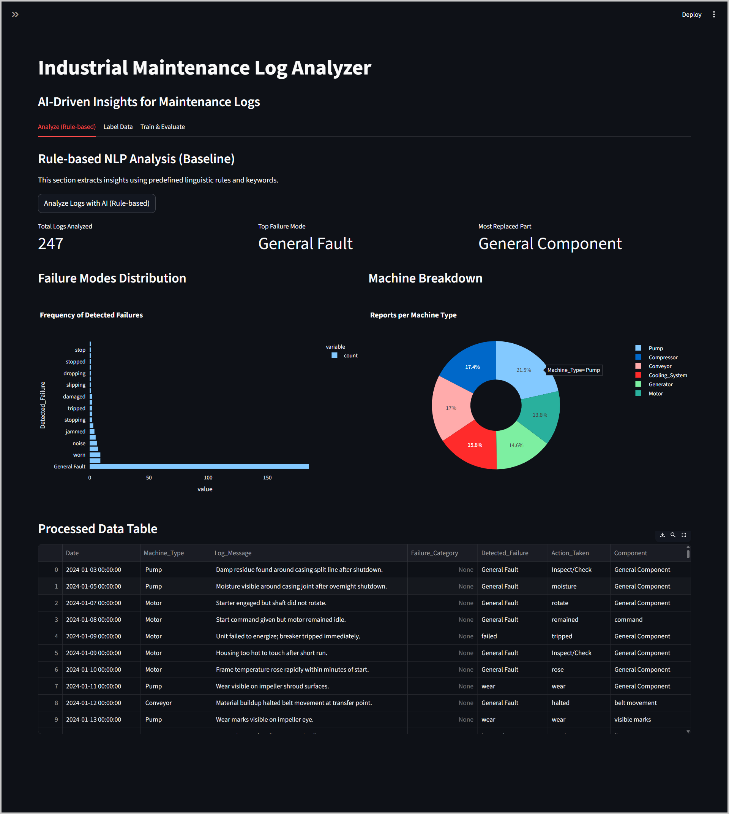
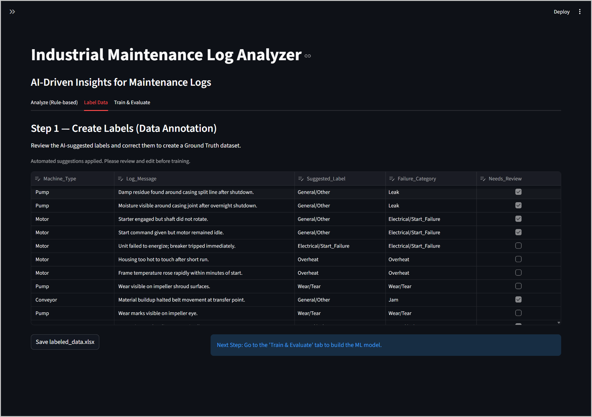
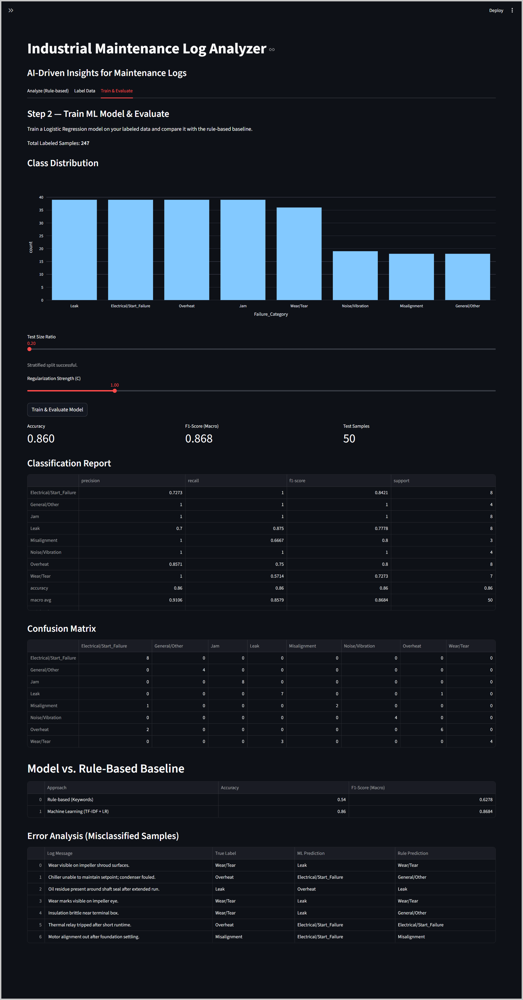

# Industrial Maintenance Log Analyzer: Rule-Based vs. ML


> **A Human-in-the-Loop (HITL) system to automate maintenance log analysis, bridging traditional rule-based methods and machine learning for smarter decision-making.**



---

## Project Overview

In the world of industrial maintenance, log data is often messy and inconsistent. While rule-based systems (such as regex or keyword matching) offer a quick solution, they struggle to capture complex linguistic details or subtle patterns in the data.

This project aims to solve this problem by combining the reliability of traditional methods with the power of Machine Learning. It provides a complete pipeline that starts with **Rule-Based Extraction** using spaCy and regex, moves through **Human Annotation** for label refinement, and ultimately trains a **Machine Learning Model** (Logistic Regression) for automatic failure classification.

Due to the confidentiality of real industrial data, a synthetic dataset generated by AI was used to simulate the pipeline functionality and prototype the Human-in-the-Loop workflow.

### Key Features:
- **Hybrid Approach:** Compares traditional rule-based classification with probabilistic machine learning models.
- **Information Extraction:** Leverages spaCy dependency parsing to identify key triplets from the log: *(Failure Mode, Action Taken, Component)*.
- **Human-in-the-loop Labeling:** Offers a review interface for experts to refine model suggestions and generate a robust labeled dataset.
- **Performance Benchmarks:** Real-time comparison of rule-based vs. machine learning results, including metrics like accuracy and F1-score.

---

## Technical Approach

This project follows a standard data science lifecycle but tailored for industrial applications:

### 1. Rule-Based Extraction (The Initial Approach)
Before diving into machine learning, we begin with heuristic methods to quickly extract useful information:
- **Keyword Matching:** We use regular expressions to detect common failure keywords like `leak` or `vibration`.
- **Dependency Parsing:** With spaCy, we extract key relationships, such as the verb-action (e.g., "Replaced valve") and its target component.

### 2. Human-in-the-Loop Labeling


To build a high-quality dataset for training, the system first suggests labels based on the rules. The domain expert then reviews and corrects these labels:
```math
\text{Final Label} = \text{Human Review}(\text{Suggested Label from Rules})
```
This ensures that the labeled dataset is accurate and reliable for model training.

### 3. Model Training & Evaluation
Once the labeled data is ready, the text classification task is handled with machine learning:
- **Vectorization:** We use TF-IDF (Term Frequency-Inverse Document Frequency) with n-grams (1,2) for feature extraction.
- **Classifier:** Logistic Regression, with class balancing to account for imbalanced failure categories.
- **Evaluation Metric:** F1-Score (Macro) is the primary metric to handle class imbalances, which is more meaningful than raw accuracy in this context.

---

## Installation & Usage

### Prerequisites:
- Python 3.8 or later
- `pip` package manager

### Setup Instructions:

1. **Clone the Repository:**
    ```bash
    git clone https://github.com/sina-sm/maintenance-log-analyzer.git
    cd maintenance-log-analyzer
    ```

2. **Install Dependencies:**
    ```bash
    pip install -r requirements.txt
    python -m spacy download en_core_web_sm
    ```

3. **Run the Application:**
    ```bash
    streamlit run app.py
    ```

4. **Access the Dashboard:**
    Open your browser and visit `http://localhost:8501` to interact with the application.

---

## Project Structure

Here’s an overview of the project structure:

```text
├── app.py               # Main Application (UI, NLP Logic, Training Pipeline)
├── data.xlsx            # Raw input data (Unstructured Logs)
├── labeled_data.xlsx    # Generated Ground Truth (Output of Labeling Step)
└── requirements.txt     # Python dependencies
```
## Evaluation Results



The system demonstrates how Human-in-the-Loop can improve accuracy by correcting rule-based errors over time.:

* **Rule-Based Approach:** Accuracy ~54% | F1-Score ~0.63
* **Logistic Regression (ML):** Accuracy ~86% | F1-Score ~0.88

Overall, the ML model offers a clear performance gain while the rule-based baseline still provides a fast, interpretable starting point. Together, they highlight the value of HITL refinement for steady accuracy improvements in real-world maintenance logs.

*Results depend on dataset*

## Author

**Sina Soleimani Moghaddam**  
Computer Engineering Graduate | AI & ML Practitioner

Feel free to connect with me on [LinkedIn](https://www.linkedin.com/in/sina-soleimani-moghaddam/) or via [Email](mailto:sina.soleimani.moghaddam@gmail.com).
